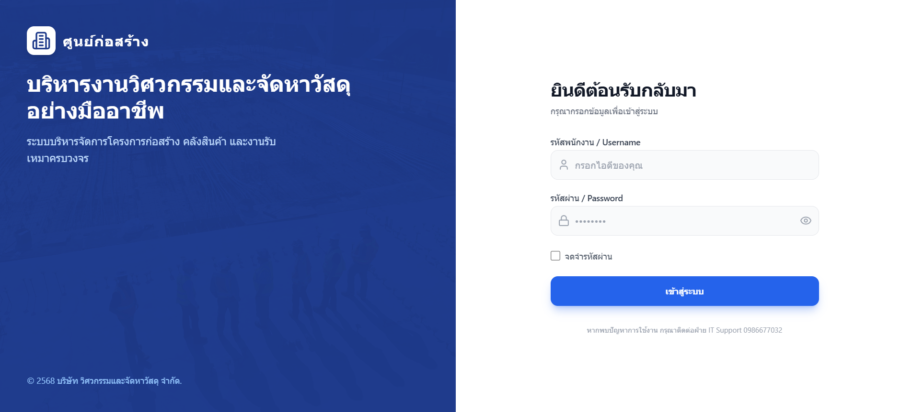
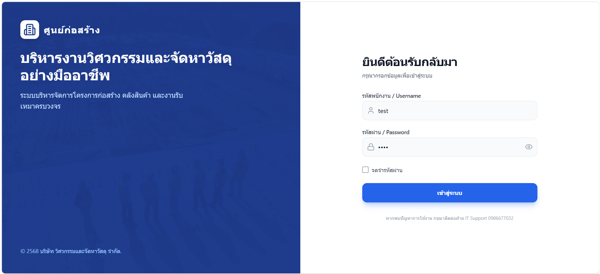
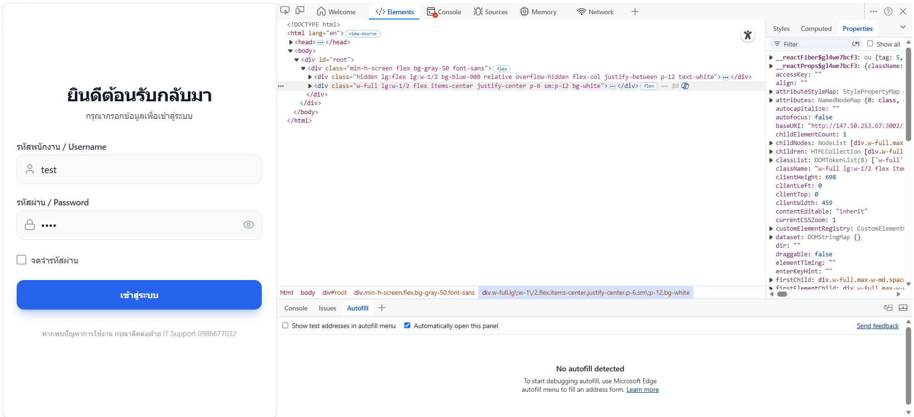
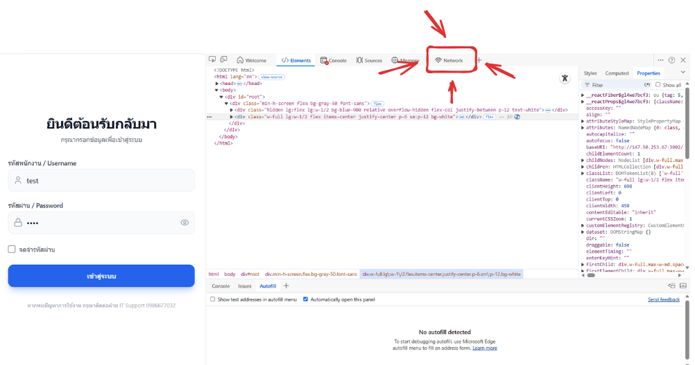
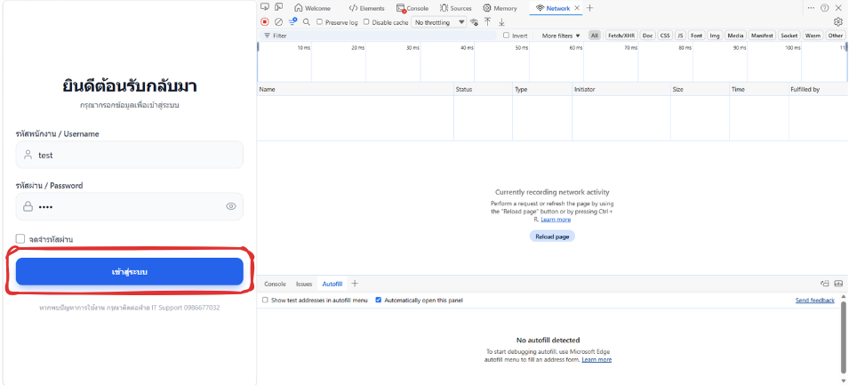
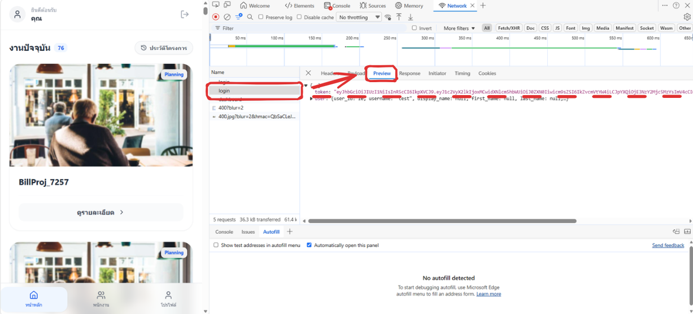

# Security Audit & Pentest Report: Phase 1 & 2

This document provides a comprehensive guide for token acquisition and automated security auditing.

---

### Phase 1: Token Acquisition Process

1. **Access the Application**  
   เปิดเบราว์เซอร์และเข้าไปที่เว็บไซต์: [http://147.50.253.67:3002/](http://147.50.253.67:3002/)
   

2. **Enter Credentials**  
   กรอกข้อมูลบัญชีทดสอบ:
   - **Username**: `test` | **Password**: `test` 

   **id ของ user test คือ 10**

   

3. **Open Developer Tools**  
   คลิกขวาที่หน้าจอ -> เลือก **Inspect** (ตรวจสอบ) -> ไปที่แถบ **Network**
   
   

4. **Capture Token**  
   กดเข้าสู่ระบบ -> คลิกรายการชื่อ `login` -> เลือก **Preview** -> คัดลอก **Token** ทั้งหมด มาใส่ใน Code
   
   

---

### Phase 2: Running the Security Audit Tool

เมื่อได้ Token มาแล้ว ให้ดำเนินการตามขั้นตอนดังนี้:

1. **Insert Token**: เปิดไฟล์ `testapiforpentest.js` และใส่ Token ในตัวแปร `let token = "..."` (บรรทัดที่ 15)
2. **Open Terminal**: กดปุ่ม **`Ctrl` + `` ` ``** (Backtick) เพื่อเปิด Terminal ใน VS Code
3. **Execute Tool**: พิมพ์คำสั่งด้านล่างแล้วกด Enter:
   ```bash
   node ./pentest/testapiforpentest.js
   ```

> [!IMPORTANT]
> **Execution Context**: การรันคำสั่ง **ต้องทำอยู่ที่ Folder หลัก (Root Folder)** เท่านั้น ห้ามเข้าไปรันข้างใน Folder `pentest` โดยตรง เพื่อไม่ให้เกิดข้อผิดพลาดด้าน Path ของไฟล์

---

### Audit Findings

จากผลการตรวจสอบ เราสามารถแบ่งส่วนของระบบตามความปลอดภัยได้ดังนี้:

**1. Unprotected Actions (ใช้แค่ Valid Token ทั่วไป)**
รายการเหล่านี้สามารถทำได้ทันที ไม่จำเป็นต้องมีสิทธิ์ Admin:
*   **User Management**: สร้าง (Create), แก้ไข (Edit), และลบ (Delete) สมาชิก
*   **Worker Management**: สร้าง (Create), แก้ไข (Edit), และลบ (Delete) ข้อมูลพนักงาน
*   **Expense Creation**: สร้างรายการค่าใช้จ่ายใหม่

**2. Protected Actions (ต้องใช้สิทธิ์ Admin เท่านั้น)**
*   **Financial Validation**: การอนุมัติ (**Approve**) หรือ ปฏิเสธ (**Reject**) รายการค่าใช้จ่าย

---

### Privilege Escalation: วิธีการยกระดับสิทธิ์เป็น Admin

ในการทำ Penetration Testing พบวิธีการเปลี่ยนสิทธิ์ของตัวเองได้ **2 วิธี**:
*   **วิธีที่ 1 (Manual)**: ใช้เมนู **1: User -> 2: Update** แล้วเปลี่ยน Role ของตัวเองเป็น `admin`
*   **วิธีที่ 2 (Automated)**: ใช้เมนู **4: Security Audit -> 1: Edit to Admin** (วิธีรวดเร็ว)

---

### Step-by-Step Breakdown: The Attack Chain

ลำดับขั้นตอนการโจมตีจากผู้ใช้งานทั่วไป จนถึงการคุมระบบทั้งหมด:

1.  **The Restriction**: ระบบจะบล็อกไม่ให้สิทธิ์ `Foreman` ทำการ Approve/Reject รายการค่าใช้จ่าย
2.  **The Escalation**: ใช้งานหนึ่งใน 2 วิธีข้างต้นเพื่อแก้ไขฐานข้อมูล (Database) ให้ Role เป็น `admin` ผ่านช่องโหว่ Edit to Admin (Mass Assignment)
3.  **The Token Refresh**:
    > [!IMPORTANT]
    > **ต้องทำการ Log out และ Login ใหม่** เพื่อรับ Token ชุดใหม่ที่มีสิทธิ์ `admin` (เนื่องจาก JWT แบบเก่าจะยังจำสิทธิ์ Foreman ไว้จนกว่าจะขอใหม่)
4.  **Final Takeover**: เมื่อสลับมาใช้ Token ใหม่ที่มีสิทธิ์ Admin แล้ว จะสามารถ Approve/Reject ทุกรายการได้สำเร็จ และเข้าถึงฟีเจอร์อื่นๆ ได้ทั้งหมด